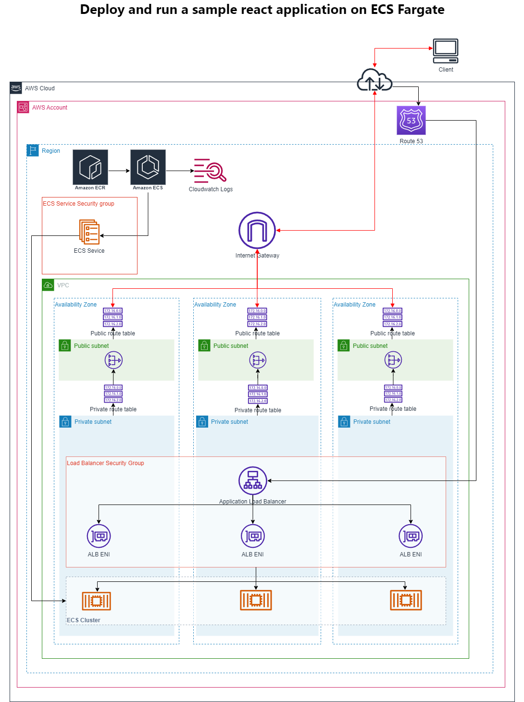

# Deploy and run a sample react application on ECS Fargate

This POC provisions the resources needed to run a sample react application in ECS Fargate. The primary objective of this POC is to automate the provisioning of resources using Terraform and GitHub actions.

The application code is the sample-app folder 

## Architecture


## Terraform Modules
The Terraform modules in this POC are:

- VPC - Provisions the VPC, the public and private subnets, internet gateway, public route tables, route table associations for the public subnets, and VPC endpoints

- Nat Gateway - Provisions the Elastic IPs, Nat Gateways, the private route tables, and route table association for the private subnets

- IAM - Provisions the IAM role for ecs task execution and attaches AmazonECSTaskExecutionRolePolicy to the role

- Route 53 - Provisions the hosted zone for the application dns records and creates the dns records. Utilises the terraform-aws-modules/route53/aws//modules/records module

- ACM - Provisions the certificate with dns validation for the domain to be used by the application. Utilises terraform-aws-modules/acm/aws module

- ALB - Provisions an application load balancer, security group for the load balancer, http and https listeners, target group, and a listener rule to forward 443 traffic from the load balancer to the target group

- ECS - Provisions the ECS cluster, capacity providers for FARGATE_SPOT, task definition, cloudwatch log group, ecs service and security group for the ecs service.

## Prerequisites
- Sample application
    - Node.js v18.16.0 or higher
- Terraform
    - Terraform 1.5.5 or higher
- AWS CLI
    - Version 2.12.0 or higher
- Experience with AWS
- Experience with Terraform

## Setup
### Sample application
```bash
# Install the app
npm install

# Start the app - uses port 3000
npm start
```

### AWS
#### Open ID Connect and ECR Repository
This project uses OpenID Connect to talk to AWS. There is a Terraform module that does this for you but I had to remove it out of the main infrastructure code for this POC as it is a catch 22 if deploying through Github Actions! You need the integration there for the Github Actions Workflow to run and provision your infrastructure. 

Steps to setup:
1. Go to the \setup-infrastructure\code folder
    ```bash
    cd .\setup-infrastructure\code
    ```
2. Create your terraform.tfvars file and add these variables
    ```tf
    region = "eu-west-2" #region of your choice
    repositories = ["<path to your github repo here>"] #This needs to be in the format github-account/repo-name e.g. yasser-abbasi-git/ecs-fargate-poc
    ecr_repository_name = "<name of ecr repository to create>"
    ```
3. Ensure the AWS CLI profile you are running Terraform with has at least the following permissions:
    ```json
    {
    "Version": "2012-10-17",
    "Statement": [
        {
            "Effect": "Allow",
            "Action": [
                "iam:CreateOpenIDConnectProvider",
                "iam:DeleteOpenIDConnectProvider",
                "iam:CreateRole",
                "iam:DeleteRole",
                "iam:CreatePolicy",
                "iam:DeletePolicy",
                "iam:GetPolicy",
                "iam:GetPolicyVersion",
                "iam:ListPolicyVersions",
                "iam:AttachRolePolicy",
                "iam:DetachRolePolicy",
                "iam:ListInstanceProfilesForRole",
                "iam:GetOpenIDConnectProvider",
                "iam:GetRole",
                "iam:ListRolePolicies",
                "iam:ListAttachedRolePolicies",
                "ecr:CreateRepository",
                "ecr:DescribeRepositories",
                "ecr:DeleteRepository",
                "ecr:ListTagsForResource",
                "ecr:PutLifecyclePolicy",
                "ecr:GetLifecyclePolicy",
                "ecr:SetRepositoryPolicy",
                "ecr:GetRepositoryPolicy",
                "ecr:DeleteRepositoryPolicy",
                "ecr:DeleteLifecyclePolicy",
                "ecr:PutImageTagMutability"
            ],
            "Resource": "*"
        }
    ]}
    ```
4. Run Terraform commands
    ```tf
    terraform init
    ```
    ```tf
    terraform plan #Review the generated plan
    ```
    ```tf
    terraform apply #confirm with yes
    ```
This will create the identify provider, role and trust relationship for integration between GitHub and your AWS account. This will also create the ECR repository to store your docker images.

This also creates policy called "SampleAppTerraformAccess" which has the permission needed to run the code for the POC. This policy is attached to the github-oidc-provider-aws role created by this setup.

>**If you would like to try out/run the Terraform code for this POC from your local machine, then you can attach the "SampleAppTerraformAccess" policy to the group/user for your AWS credentials used for running Terraform.**

#### ECR Repository
> Please note, the ECR repository is created with "MUTABLE" tag, which isn't best practice, it is recommended the tag is set to "IMMUTABLE". In this POC I'm always tagging the docker image with the "latest" tag which replaces the last image uploaded with the same tag, using the "IMMUTABLE" tag will not work in this scenario.

#### Root Domain Hosted Zone and ACM certificate
This is the hosted zone for the root domain I registered with AWS Route 53. This will act as the parent domain. The root domain hosted zone needs to be there in your AWS account in the specified region and a valid ACM certificate should be there for the root domain.

For more info read:

[Working with public hosted zones](https://docs.aws.amazon.com/Route53/latest/DeveloperGuide/AboutHZWorkingWith.html)

[Registering and managing domains using Amazon Route 53](https://docs.aws.amazon.com/Route53/latest/DeveloperGuide/registrar.html)

[Issuing and managing certificates](https://docs.aws.amazon.com/acm/latest/userguide/gs.html)

[DNS Delegation](https://notes.paulswail.com/public/How+to+delegate+DNS+for+subdomains+to+a+different+Route53+HostedZone)

### Terraform
#### Backend
To make it easier, there is cloudformation template in /backend-infrastructure/code/backend.yaml that will create the CloudFormation stack for you. To create the stack, run the command

```bash
aws cloudformation create-stack --stack-name terraform-backend
   --template-body file:///backend-infrastructure/code/backend.yaml
   --parameters ParameterKey=StateBucketName,ParameterValue=<bucket_name_to_create> ParameterKey=LockTableName,ParameterValue=<lock_table_name_to_create>
```
- Replace <bucket_name_to_create> with your bucket name
- Replace <lock_table_name_to_create> with your DynamoDB lock table name

You will need to update the bucket and dynamodb_table values in the /infrastructure/code/state.tf file accordingly.

#### Variables
The Terraform code expects the following variables are set:

- region (string) - The AWS region where the resources will be created
- project_name (string) - The name of the project used for tagging resources
- vpc_data (object) - Variable to hold and object for vpc configuration. The structure of the object is:
    ```tf
    type = object({
        vpc_cidr = string
        availability_zones = list(object({
        az_name                 = string
        public_subnet_cidr      = string
        private_app_subnet_cidr = string
        private_db_subnet_cidr  = string
        }))
    })
    ```
- root_domain (string) - Root domain for the application. This is the parent domain where the NS records will be created for the sub-domain hosted zone for DNS delegation
- app_subdomain(string) - The subdomain name to use for the application. e.g. "web"
- app_name (string) - Name of the application used for tagging resources
- app_hosted_zone_name (string) - Name of the hosted zone for the application dns records. This zone will be created by the Terraform code. e.g. "playground"
- image_path (string) - Path to ECR repository to pull the image from
- image_tag (string) - The tag to fetch for the image from the repository

You can create your terraform.tfvars file in \infrastructure\code folder which looks like this:
```tf
region       = "eu-west-2"
project_name = "ecs-fargate-poc"

vpc_data = {
  vpc_cidr = "10.0.0.0/16"
  availability_zones = [{
    az_name                 = "eu-west-2a"
    public_subnet_cidr      = "10.0.0.0/20"
    private_app_subnet_cidr = "10.0.64.0/20"
    private_db_subnet_cidr  = "10.0.128.0/20"
    },
    {
      az_name                 = "eu-west-2b"
      public_subnet_cidr      = "10.0.16.0/20"
      private_app_subnet_cidr = "10.0.80.0/20"
      private_db_subnet_cidr  = "10.0.144.0/20"
    },
    {
      az_name                 = "eu-west-2c"
      public_subnet_cidr      = "10.0.32.0/20"
      private_app_subnet_cidr = "10.0.96.0/20"
      private_db_subnet_cidr  = "10.0.160.0/20"
  }]
}

root_domain          = "<your root domain>" #e.g. yasserabbasi.com
app_subdomain        = "web"
app_name             = "sample-app"
app_hosted_zone_name = "playground"

#image_path will be in the format <your aws account id>.dkr.ecr.<region>.amazonaws.com/<name of your ecr repository>
image_path           = "<path to your docker images repository>" 
image_tag            = "latest"
```

### Permissions
This project uses the principle of least privilege. It can be a time consuming task to figure out the exact privileges needed for your terraform code to run. I came across this cool tool [iamlive](https://github.com/iann0036/iamlive) created by [Ian McKay](https://github.com/iann0036) that massively helps to figure out the security permissions needed.

I Followed this [article](https://meirg.co.il/2021/04/23/determining-aws-iam-policies-according-to-terraform-and-aws-cli/) by [Meir Gabay](https://meirg.co.il/about/) to run iamlive in a docker container to extract the permissions. The tool identified about 80% of the permissions and the rest I had to figure out by running terraform plan/apply and seeing where it failed, but still, a pretty cool and awesome tool!

If you went through the setup steps above, a  policy with these permissions should already have been created in your AWS account with the name "SampleAppTerraformAccess" and attached to the 	
github-oidc-provider-aws role.

Attach the same policy to the aws account you are using to run terraform locally. This way, the aws account you use to run terraform commands locally and the GitHub Actions workflow will have exactly the same permissions as needed by this repository.

### GitHub Actions
- Create the following Github Actions repository variables in your repository 
- ```TF_DESTROY```
    - When set to false, the terraform plan and apply commands run as part of the infrastructure build.
    - When set to true, terraform destroy command runs as part of the infrastructure build.
- ```REGION``` - Set the value to our preferred region
- ECR_REPOSITORY_NAME - Set the value to your ECR repository name


## Credits
- [iamlive](https://github.com/iann0036/iamlive) by [Ian McKay](https://github.com/iann0036)
- [Running iamlive in a docker container](https://meirg.co.il/2021/04/23/determining-aws-iam-policies-according-to-terraform-and-aws-cli/) by [Meir Gabay](https://meirg.co.il/about/)

## License

MIT License

Copyright (c) 2023 Yasser Abbasi

Permission is hereby granted, free of charge, to any person obtaining a copy
of this software and associated documentation files (the "Software"), to deal
in the Software without restriction, including without limitation the rights
to use, copy, modify, merge, publish, distribute, sublicense, and/or sell
copies of the Software, and to permit persons to whom the Software is
furnished to do so, subject to the following conditions:

The above copyright notice and this permission notice shall be included in all
copies or substantial portions of the Software.

THE SOFTWARE IS PROVIDED "AS IS", WITHOUT WARRANTY OF ANY KIND, EXPRESS OR
IMPLIED, INCLUDING BUT NOT LIMITED TO THE WARRANTIES OF MERCHANTABILITY,
FITNESS FOR A PARTICULAR PURPOSE AND NONINFRINGEMENT. IN NO EVENT SHALL THE
AUTHORS OR COPYRIGHT HOLDERS BE LIABLE FOR ANY CLAIM, DAMAGES OR OTHER
LIABILITY, WHETHER IN AN ACTION OF CONTRACT, TORT OR OTHERWISE, ARISING FROM,
OUT OF OR IN CONNECTION WITH THE SOFTWARE OR THE USE OR OTHER DEALINGS IN THE
SOFTWARE.